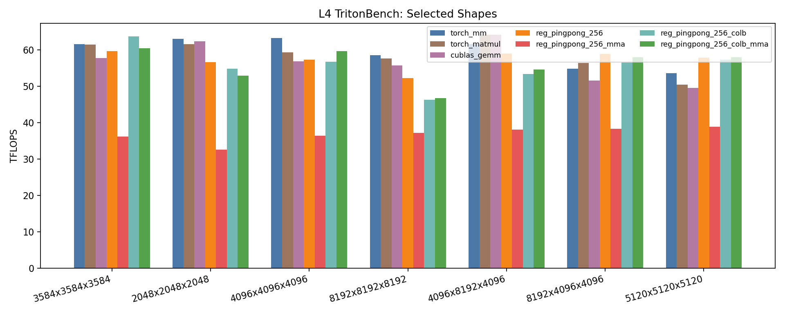
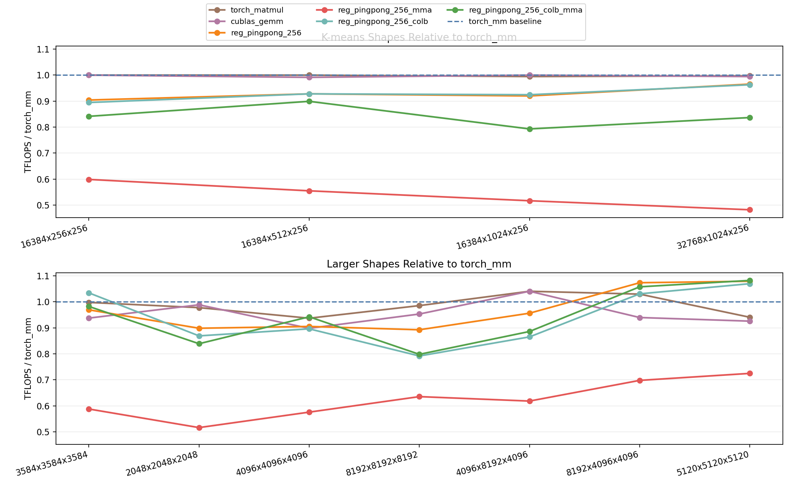

# Ampere-Gemm

Standalone CUDA Tensor Core GEMM experiments for Ampere-class GPUs, benchmarked on NVIDIA L4.

The repo contains a PyTorch CUDA extension, TritonBench and Modal benchmark harnesses, and custom GEMM kernels under `src/tensorcore_gemm`.

## Optimization Methods

- CTA tiling: `256 x 128 x 32`
- warp tiling: `64 x 64`
- Tensor Core instruction shape: `16 x 8 x 16`
- triple-buffered `cp.async` shared-memory staging
- register ping-pong over the two `k_step=0/16` halves
- shared-memory padding to reduce bank conflicts
- swizzled CTA traversal
- WMMA fragment path
- low-level `ldmatrix` + `mma.sync` PTX path
- optional pre-transposed / column-major `B` path

## Kernel Variants

- `reg_pingpong_256`
- `reg_pingpong_256_mma`
- `reg_pingpong_256_colb`
- `reg_pingpong_256_colb_mma`

Implementation files:

- [src/tensorcore_gemm/reg_pingpong_256.cu](./src/tensorcore_gemm/reg_pingpong_256.cu)
- [src/tensorcore_gemm/reg_pingpong_256_mma.cu](./src/tensorcore_gemm/reg_pingpong_256_mma.cu)
- [src/tensorcore_gemm/reg_pingpong_256_colb.cu](./src/tensorcore_gemm/reg_pingpong_256_colb.cu)
- [src/tensorcore_gemm/reg_pingpong_256_colb_mma.cu](./src/tensorcore_gemm/reg_pingpong_256_colb_mma.cu)

Shared code:

- [src/tensorcore_gemm/ptx_primitives.cuh](./src/tensorcore_gemm/ptx_primitives.cuh)
- [src/tensorcore_gemm/gemm_256_common.cuh](./src/tensorcore_gemm/gemm_256_common.cuh)

## Benchmark Summary

The large-shape plot includes the custom kernels together with `torch_mm`, `torch_matmul`, and `cublas_gemm`.

The baseline-relative plot compares every backend against `torch_mm` on each tested shape using `TFLOPS / torch_mm`.

The `colb` variants are benchmarked with `B` pretransposed so the plots measure kernel runtime instead of transpose overhead.





K-means-like shapes on L4 (`results/l4-tritonbench-20260408-121555.json`):

| Shape | torch_mm | torch_matmul | cublas_gemm | 256 | 256_mma | 256_colb | 256_colb_mma |
|---|---:|---:|---:|---:|---:|---:|---:|
| `16384x256x256` | 24.67 | 24.67 | 24.67 | 22.31 | 14.78 | 22.08 | 20.76 |
| `16384x512x256` | 36.16 | 36.16 | 35.85 | 33.55 | 20.07 | 33.55 | 32.51 |
| `16384x1024x256` | 45.59 | 45.34 | 45.59 | 41.94 | 23.56 | 42.15 | 36.16 |
| `32768x1024x256` | 46.09 | 45.96 | 45.84 | 44.50 | 22.22 | 44.38 | 38.57 |

Larger shapes on L4 (`results/l4-tritonbench-20260408-121605.json`):

| Shape | torch_mm | torch_matmul | cublas_gemm | 256 | 256_mma | 256_colb | 256_colb_mma |
|---|---:|---:|---:|---:|---:|---:|---:|
| `2048x2048x2048` | 63.07 | 61.68 | 62.37 | 56.68 | 32.58 | 54.83 | 52.92 |
| `4096x4096x4096` | 63.34 | 59.36 | 56.90 | 57.36 | 36.48 | 56.78 | 59.71 |
| `8192x8192x8192` | 58.54 | 57.71 | 55.81 | 52.26 | 37.21 | 46.36 | 46.73 |
| `4096x8192x4096` | 61.68 | 64.20 | 64.20 | 59.00 | 38.15 | 53.38 | 54.66 |
| `8192x4096x4096` | 54.86 | 56.50 | 51.56 | 58.91 | 38.30 | 56.56 | 58.04 |

More detail:

- [src/tensorcore_gemm/GEMM_VARIANTS.md](./src/tensorcore_gemm/GEMM_VARIANTS.md)

## Quick Start

Requirements:
- CUDA-capable NVIDIA GPU
- Python 3.11
- `uv`

Build:

```bash
uv sync --extra cuda --extra bench
```

Run local benchmark:

```bash
uv run python benchmark.py --m 4096 --n 4096 --k 4096
```

Run TritonBench on Modal L4:

```bash
uv run modal run modal_runner.py --action tritonbench --cases 4096x4096x4096 --warmup 20 --iters 50 --modes reg_pingpong_256,reg_pingpong_256_mma,reg_pingpong_256_colb,reg_pingpong_256_colb_mma
```

## Project Structure

- `src/tensorcore_gemm/gemm.cu`: canonical CUDA source used by the runtime wrapper
- `src/tensorcore_gemm/gemm.py`: Python API and mode dispatch
- `src/tensorcore_gemm/cublas_gemm.cu`: cuBLAS reference path
- `src/tensorcore_gemm/reg_pingpong_256*.cu`: custom GEMM kernels
- `benchmark_tritonbench.py`: TritonBench harness
- `modal_runner.py`: Modal runner for NVIDIA L4
- `plots/`: generated figures
- `results/`: saved benchmark outputs

## Constraints

The optimized `reg_pingpong_256*` path requires:

- `torch.float16`
- contiguous 2D inputs
- `M % 256 == 0`
- `N % 128 == 0`
- `K % 32 == 0`
- `K >= 64`

Outside those constraints, the wrapper falls back to `torch.matmul`.
