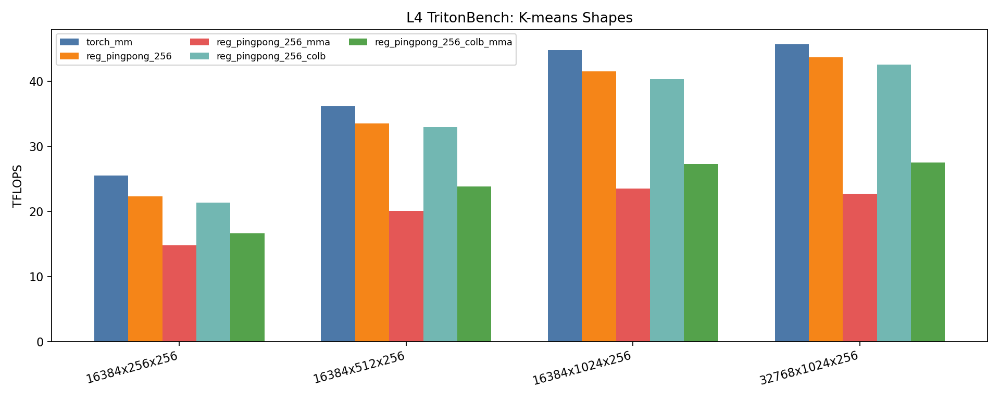

# Ampere-Gemm

Standalone CUDA Tensor Core GEMM experiments for Ampere-class GPUs, focused on a `256x128x32` tiled HGEMM path and benchmarked on NVIDIA L4.

The repo contains:

- a runtime PyTorch extension under `src/tensorcore_gemm`
- TritonBench and Modal benchmark harnesses
- a clean snapshot of the four main `256` variants under `src/tensorcore_gemm/implementations/gemm_256_variants`

## Optimization Methods

- CTA tiling: `256 x 128 x 32`
- warp tiling: `64 x 64`
- Tensor Core instruction shape: `16 x 8 x 16`
- triple-buffered `cp.async` shared-memory staging
- register ping-pong over the two `k_step=0/16` halves
- shared-memory padding to reduce bank conflicts
- swizzled CTA traversal
- WMMA fragment path
- low-level `ldmatrix` + `mma.sync` PTX path
- optional pre-transposed / column-major `B` path

## Kernel Variants

- `reg_pingpong_256`
- `reg_pingpong_256_mma`
- `reg_pingpong_256_colb`
- `reg_pingpong_256_colb_mma`

Implementation snapshot:

- [src/tensorcore_gemm/implementations/gemm_256_variants/reg_pingpong_256.cu](./src/tensorcore_gemm/implementations/gemm_256_variants/reg_pingpong_256.cu)
- [src/tensorcore_gemm/implementations/gemm_256_variants/reg_pingpong_256_mma.cu](./src/tensorcore_gemm/implementations/gemm_256_variants/reg_pingpong_256_mma.cu)
- [src/tensorcore_gemm/implementations/gemm_256_variants/reg_pingpong_256_colb.cu](./src/tensorcore_gemm/implementations/gemm_256_variants/reg_pingpong_256_colb.cu)
- [src/tensorcore_gemm/implementations/gemm_256_variants/reg_pingpong_256_colb_mma.cu](./src/tensorcore_gemm/implementations/gemm_256_variants/reg_pingpong_256_colb_mma.cu)

Shared code:

- [src/tensorcore_gemm/implementations/gemm_256_variants/ptx_primitives.cuh](./src/tensorcore_gemm/implementations/gemm_256_variants/ptx_primitives.cuh)
- [src/tensorcore_gemm/implementations/gemm_256_variants/gemm_256_common.cuh](./src/tensorcore_gemm/implementations/gemm_256_variants/gemm_256_common.cuh)

## Project Structure

- `src/tensorcore_gemm/gemm.cu`: canonical CUDA source used by the runtime wrapper
- `src/tensorcore_gemm/gemm.py`: Python API and mode dispatch
- `src/tensorcore_gemm/cublas_gemm.cu`: cuBLAS comparison path
- `src/tensorcore_gemm/implementations/gemm_256_variants/`: extracted variant implementations
- `benchmark_tritonbench.py`: TritonBench harness
- `modal_runner.py`: Modal L4 runner
- `results/`: saved benchmark outputs

## Requirements

- CUDA-capable NVIDIA GPU
- Python 3.11
- `uv`

Optimized `reg_pingpong_256*` path constraints:

- `torch.float16`
- contiguous 2D inputs
- `M % 256 == 0`
- `N % 128 == 0`
- `K % 32 == 0`
- `K >= 64`

Outside those constraints, the wrapper falls back to `torch.matmul`.

## Build

```bash
uv sync --extra cuda --extra bench
```

## Run

Local benchmark:

```bash
uv run python benchmark.py --m 4096 --n 4096 --k 4096
```

TritonBench on Modal L4:

```bash
uv run modal run modal_runner.py --action tritonbench --cases 4096x4096x4096 --warmup 20 --iters 50 --modes reg_pingpong_256,reg_pingpong_256_mma,reg_pingpong_256_colb,reg_pingpong_256_colb_mma
```

## Benchmark Summary

K-means-like shapes on L4 (`results/l4-tritonbench-20260408-111218.json`):

| Shape | torch_mm | 256 | 256_mma | 256_colb | 256_colb_mma |
|---|---:|---:|---:|---:|---:|
| `16384x256x256` | 25.58 | 22.31 | 14.77 | 21.40 | 16.64 |
| `16384x512x256` | 36.16 | 33.55 | 20.07 | 33.03 | 23.83 |
| `16384x1024x256` | 44.86 | 41.53 | 23.56 | 40.33 | 27.32 |
| `32768x1024x256` | 45.71 | 43.69 | 22.70 | 42.58 | 27.55 |

Larger shapes on L4 (`results/l4-tritonbench-20260408-110716.json`):

| Shape | torch_mm | 256 | 256_mma | 256_colb | 256_colb_mma |
|---|---:|---:|---:|---:|---:|
| `2048x2048x2048` | 63.07 | 57.26 | 32.96 | 39.95 | 36.00 |
| `4096x4096x4096` | 59.34 | 63.22 | 37.85 | 45.12 | 46.49 |
| `8192x8192x8192` | 59.28 | 54.14 | 37.67 | 43.39 | 40.52 |
| `4096x8192x4096` | 66.48 | 57.38 | 39.11 | 44.38 | 44.79 |
| `8192x4096x4096` | 57.32 | 59.77 | 39.09 | 52.08 | 50.52 |

Plots:

- [src/tensorcore_gemm/implementations/gemm_256_variants/plots/kmeans_tflops.png](./src/tensorcore_gemm/implementations/gemm_256_variants/plots/kmeans_tflops.png)
- [src/tensorcore_gemm/implementations/gemm_256_variants/plots/large_tflops.png](./src/tensorcore_gemm/implementations/gemm_256_variants/plots/large_tflops.png)
- [src/tensorcore_gemm/implementations/gemm_256_variants/plots/baseline_relative_tflops.png](./src/tensorcore_gemm/implementations/gemm_256_variants/plots/baseline_relative_tflops.png)

The baseline-relative plot compares each kernel against `torch_mm` on every tested shape using `TFLOPS / torch_mm`.




More detail:

- [src/tensorcore_gemm/implementations/gemm_256_variants/README.md](./src/tensorcore_gemm/implementations/gemm_256_variants/README.md)
- [REG_PINGPONG_256_COMPARISON.md](./REG_PINGPONG_256_COMPARISON.md)

## Reference

This repo is stylistically inspired by Bruce-Lee-LY's CUDA HGEMM work and the associated Tensor Core optimization write-up:

- https://github.com/Bruce-Lee-LY/cuda_hgemm
- https://bruce-lee-ly.medium.com/nvidia-tensor-core-cuda-hgemm-advanced-optimization-5a17eb77dd85
