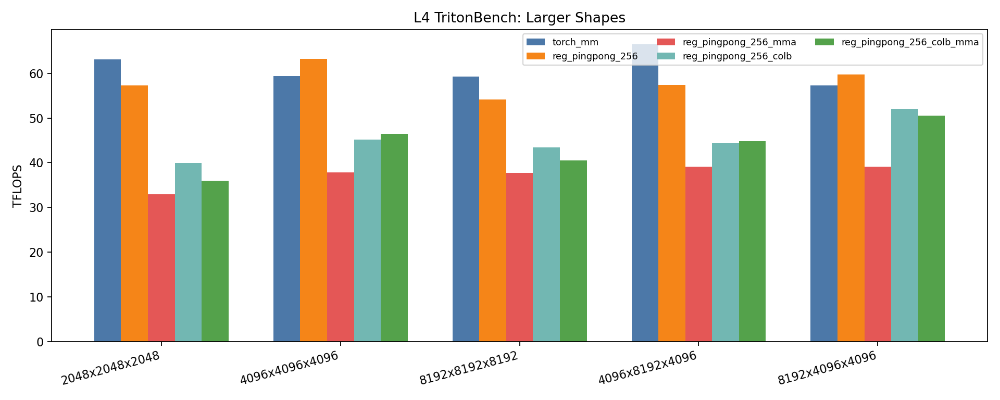
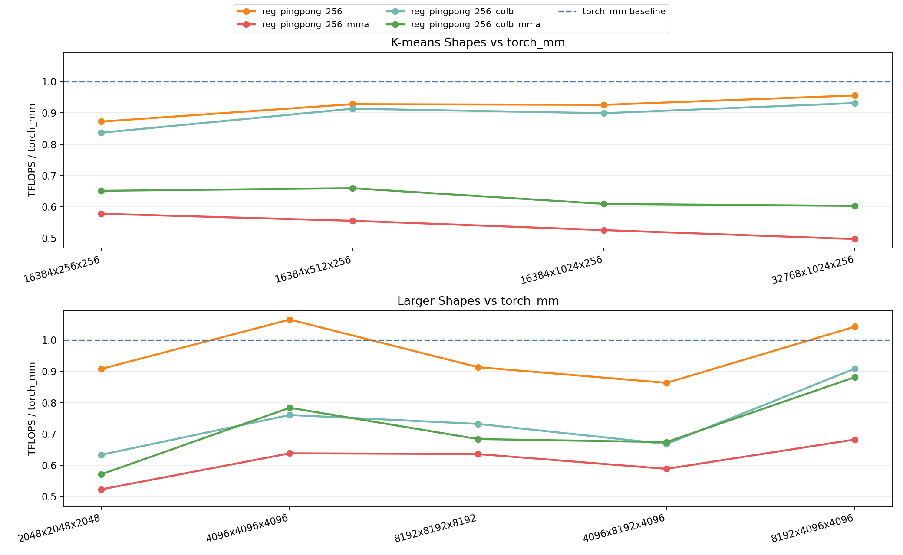

# GEMM Variants

This project contains Tensor Core GEMM implementations optimized for Ampere / Ada Lovelace CUDA architectures, with the goal of closing as much of the gap to cuBLAS as possible on practical GEMM shapes.

The implementations here use multi-stage shared-memory staging, register ping-pong, WMMA or inline MMA instructions, and alternative `B` operand layouts.

## Project Structure

- Main implementations:
  - `reg_pingpong_256.cu`
  - `reg_pingpong_256_mma.cu`
  - `reg_pingpong_256_colb.cu`
  - `reg_pingpong_256_colb_mma.cu`
- Shared PTX macros and async-copy primitives:
  - `ptx_primitives.cuh`
- Shared helpers:
  - `gemm_256_common.cuh`

## Techniques Used

- Triple-buffered `cp.async` staging over `K_TILE=32`.
- CTA tile `256x128`, warp tile `64x64`.
- Register ping-pong over two 16-wide WMMA halves (`k_step=0/16`).
- Two B-layout families:
  - row-major B for `reg_pingpong_256` and `reg_pingpong_256_mma`
  - pre-transposed col-major B for `reg_pingpong_256_colb` and `reg_pingpong_256_colb_mma`
- Two math backbones:
  - WMMA fragment API
  - inline PTX `ldmatrix` + `mma.sync` for the `*_mma` variants

## Benchmarks on Modal L4

The large-shape plot includes the custom kernels together with `torch_mm`, `torch_matmul`, and `cublas_gemm`.

The baseline-relative plot shows each backend as `TFLOPS / torch_mm` across the tested shapes, so values above `1.0` beat the baseline and values below `1.0` trail it.





Source JSONs:

- `results/l4-tritonbench-20260408-111218.json` (k-means-like shapes)
- `results/l4-tritonbench-20260408-110716.json` (larger shapes)
- `results/l4-tritonbench-20260408-112823.json` (post-epilogue spot check)

### K-means-like Shapes (TFLOPS)

| Shape (M,N,K) | torch_mm | reg_pingpong_256 | reg_pingpong_256_mma | reg_pingpong_256_colb | reg_pingpong_256_colb_mma |
|---|---:|---:|---:|---:|---:|
| 16384x256x256 | 25.58 | 22.31 | 14.77 | 21.40 | 16.64 |
| 16384x512x256 | 36.16 | 33.55 | 20.07 | 33.03 | 23.83 |
| 16384x1024x256 | 44.86 | 41.53 | 23.56 | 40.33 | 27.32 |
| 32768x1024x256 | 45.71 | 43.69 | 22.70 | 42.58 | 27.55 |

### Larger Shapes (TFLOPS)

| Shape (M,N,K) | torch_mm | reg_pingpong_256 | reg_pingpong_256_mma | reg_pingpong_256_colb | reg_pingpong_256_colb_mma |
|---|---:|---:|---:|---:|---:|
| 2048x2048x2048 | 63.07 | 57.26 | 32.96 | 39.95 | 36.00 |
| 4096x4096x4096 | 59.34 | 63.22 | 37.85 | 45.12 | 46.49 |
| 8192x8192x8192 | 59.28 | 54.14 | 37.67 | 43.39 | 40.52 |
| 4096x8192x4096 | 66.48 | 57.38 | 39.11 | 44.38 | 44.79 |
| 8192x4096x4096 | 57.32 | 59.77 | 39.09 | 52.08 | 50.52 |

Regenerate:

```bash
python src/tensorcore_gemm/implementations/gemm_256_variants/plot_benchmarks.py
```
